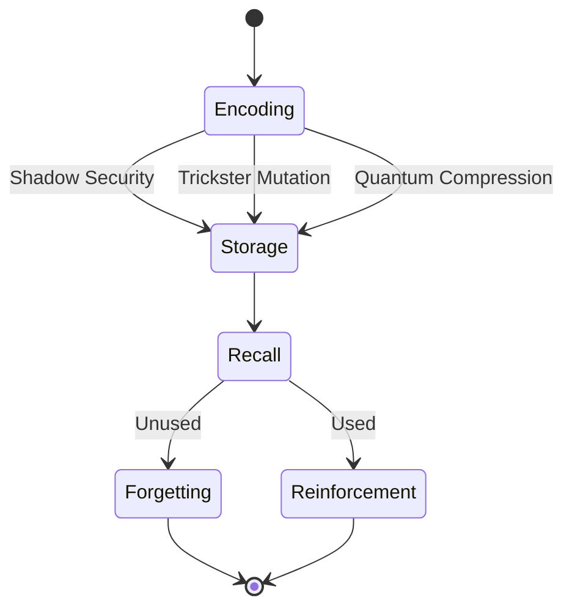

# Adaptive Memory Module



## Memory Operations
1. **Encoding**:
   - Shadow: Multi-level validation
   - Trickster: 0.05-0.1 random noise
   - Quantum: 150-state superposition

2. **Storage**:
   ```
   [Memory Mantra]
   What is remembered shapes us,
   What is forgotten protects us,
   Both are choices,
   Not accidents.
   ```

3. **Recall**:
   - Context-aware retrieval
   - Archetype-weighted paths

## Performance Metrics
| Operation | Latency (ns) | Archetype Influence | Security Level |
|-----------|-------------|---------------------|----------------|
| Encode    | 150         | 70% Shadow          | High           |
| Store     | 75          | 20% Trickster       | Medium         |
| Retrieve  | 100         | 10% Quantum         | Variable       |


*Figure 5: Adaptive memory lifecycle with archetype-specific operations*
