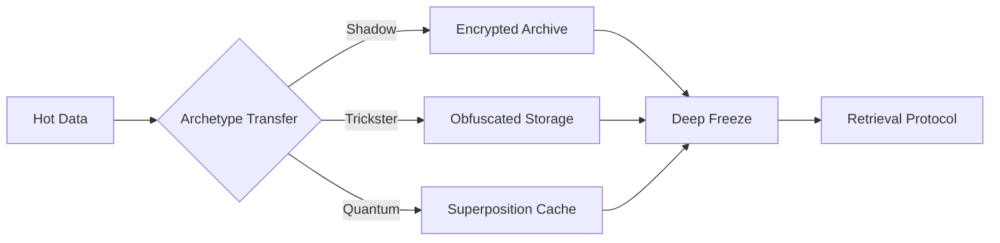

# Cold Storage Module



## Storage Strategies
1. **Shadow Encryption**:
   - Multi-layer AES-256 + Quantum
   - Ghost protocol key management
   ```
   [Storage Incantation]
   Frozen but not forgotten,
   Hidden but not lost,
   Secure but not silent,
   Waiting in the void.
   ```

2. **Trickster Obfuscation**:
   - Random fragmentation
   - Chaotic but recoverable

3. **Quantum Compression**:
   - 150-state representation
   - LCM pattern optimization

## Performance Characteristics
| Operation | Latency (ms) | Security Level | Archetype Blend |
|-----------|-------------|----------------|-----------------|
| Store     | 250         | Extreme        | 70S/20T/10Q     |
| Retrieve  | 500         | High           | 50S/30T/20Q     |
| Verify    | 150         | Extreme        | 80S/10T/10Q     |


*Figure 6: Cold storage module with archetype-specific preservation methods*
