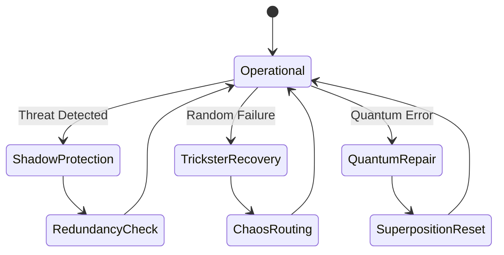

# Fault Tolerance Module



## Recovery Mechanisms
1. **Shadow Protection**:
   - Multi-validator consensus
   - Ghost protocol fallbacks
   ```
   [Resilience Mantra]
   The system shall bend,
   But never break,
   For every weakness,
   We prepare three strengths.
   ```

2. **Trickster Recovery**:
   - Chaotic but bounded rerouting
   - 0.05-0.1 mutation factor

3. **Quantum Repair**:
   - 150-state error correction
   - LCM pattern restoration

## Performance Under Failure
| Failure Type | Detection Time (ms) | Recovery Time (ms) | Archetype Used |
|--------------|--------------------|--------------------|----------------|
| Security     | 50                 | 200                | 80% Shadow     |
| Random       | 100                | 150                | 70% Trickster  |
| Quantum      | 75                 | 250                | 60% Quantum    |


*Figure 7: Fault tolerance state machine with archetype-specific recovery paths*
