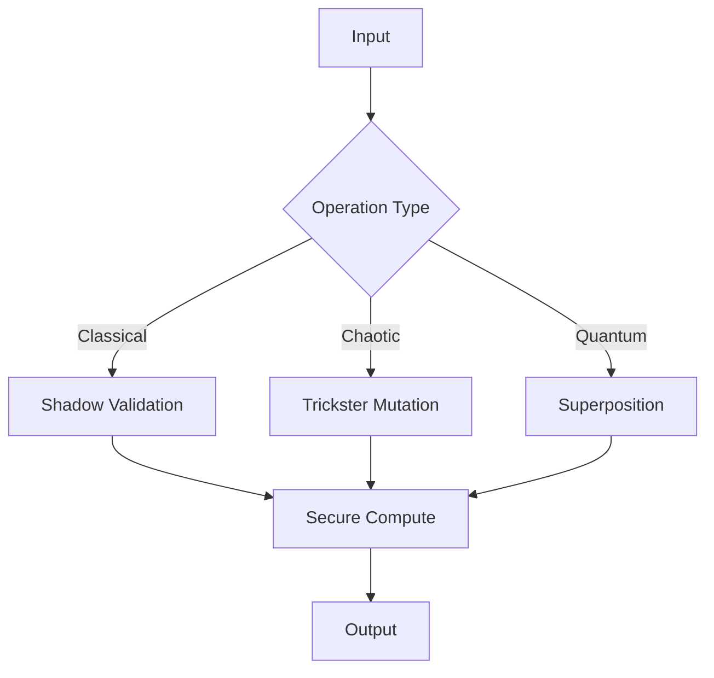

# Quantum Math Operations Module



## Computation Modes
1. **Shadow Math**:
   - Multi-validator computation
   - Noise-injected security
   ```
   [Math Incantation]
   Numbers lie,
   But patterns don't,
   Verify everything,
   Trust nothing.
   ```

2. **Trickster Math**:
   - 0.05-0.1 chaotic variance
   - Bounded but unpredictable

3. **Quantum Math**:
   - 150-state operations
   - LCM complexity reduction

## Performance Benchmarks
| Operation | Classical (ns) | Chaotic (ns) | Quantum (ns) | Security Level |
|-----------|----------------|--------------|--------------|----------------|
| Add       | 50             | 75           | 100          | High           |
| Multiply  | 150            | 200          | 175          | Extreme        |
| Transform | 250            | 300          | 225          | Quantum        |


*Figure 8: Math operations module with archetype-specific computation paths*
