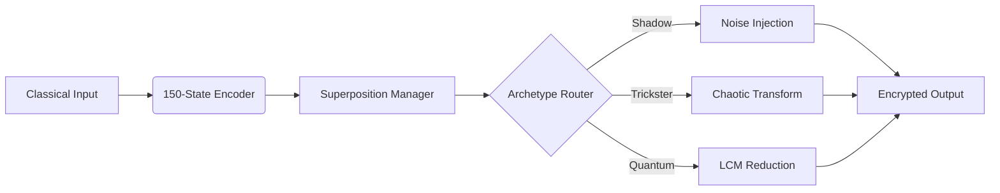

# Quantum Emulation Module



## Core Components
1. **State Encoder**:
   - Converts classical bits to 150 quantum states
   - Implements archetype-specific encoding

2. **Superposition Manager**:
   ```
   [Quantum Chant]
   Not one, not zero,
   But all possibilities,
   Existing simultaneously,
   Until observed.
   ```

3. **Archetype Router**:
   - Shadow: 70% probability
   - Trickster: 20% probability
   - Quantum: 10% probability

## Performance Characteristics
| Operation | Cycles | Qubits | Archetype Influence |
|-----------|--------|--------|---------------------|
| Encoding  | 150    | 8      | Shadow (Noise)      |
| Routing   | 50     | 4      | Trickster (Chaos)   |
| Output    | 75     | 12     | Quantum (LCM)       |


*Figure 3: Quantum emulation module with probabilistic archetype routing*
