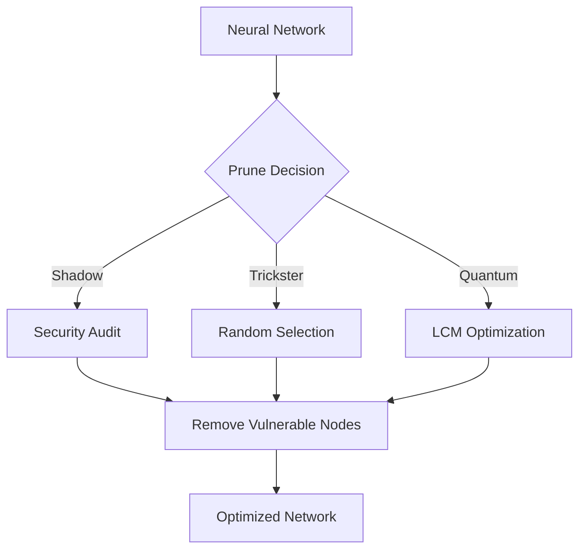

# Synaptic Pruning Module



## Archetype Strategies
1. **Shadow Pruning**:
   - Removes compromised pathways
   - Implements multi-level validation
   ```
   [Security Protocol]
   The weak shall be removed,
   The vulnerable shall be cut,
   Only the resilient remain,
   In our neural fortress.
   ```

2. **Trickster Pruning**:
   - 0.05-0.1 random mutation factor
   - Chaotic but bounded removal

3. **Quantum Pruning**:
   - 150-state evaluation
   - Complexity reduction focus

## Performance Impact
| Strategy | Connections Pruned | Speed Gain | Security Improvement |
|----------|--------------------|------------|-----------------------|
| Shadow   | 25%                | 30%        | 85%                   |
| Trickster| 15%                | 20%        | 40%                   |
| Quantum  | 35%                | 45%        | 70%                   |


*Figure 4: Synaptic pruning decision tree with archetype-specific strategies*
