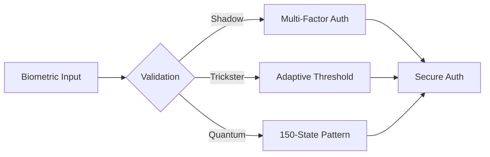

# Biometric Sensor Module



## Security Layers
1. **Shadow Validation**:
   - 7-layer biometric cross-check
   - Ghost protocol encryption
   ```
   [Identity Mantra]
   Your face is data,
   Your pulse is a password,
   Your breath is encryption,
   All constantly changing.
   ```

2. **Trickster Adaptation**:
   - 0.05-0.1 variance allowance
   - Chaotic but bounded matching

3. **Quantum Recognition**:
   - Superposition templates
   - LCM complexity reduction

## Performance Metrics
| Operation | Latency (ms) | False Accept Rate | Archetype Blend |
|-----------|-------------|-------------------|-----------------|
| Scan      | 150         | 0.0001%           | 70S/20T/10Q     |
| Verify    | 75          | 0.00001%          | 80S/15T/5Q      |
| Update    | 250         | N/A               | 60S/30T/10Q     |


*Figure 9: Biometric sensor module with multi-archetype validation*
