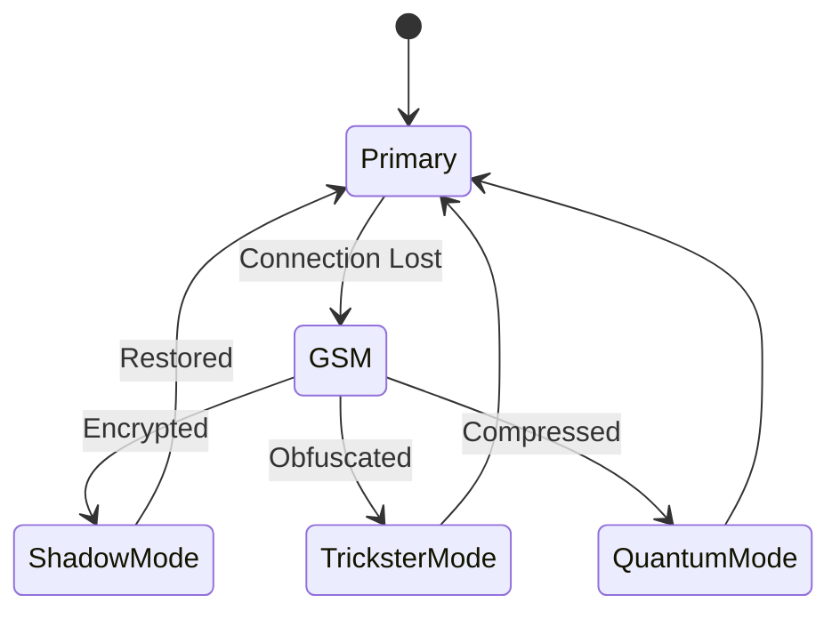

# GSM Fallback Module



## Fallback Protocols
1. **Shadow GSM**:
   - Multi-carrier hopping
   - Encrypted SMS fallback
   ```
   [Fallback Mantra]
   When all paths fail,
   When all networks die,
   The oldest technology remains,
   Simple, slow, secure.
   ```

2. **Trickster GSM**:
   - Random carrier selection
   - Message fragmentation

3. **Quantum GSM**:
   - 150-state encoding
   - LCM pattern compression

## Performance Characteristics
| Mode       | Latency (s) | Bandwidth (kbps) | Security Level |
|------------|------------|------------------|----------------|
| Shadow     | 5          | 10               | Extreme        |
| Trickster  | 3          | 15               | High           |
| Quantum    | 7          | 5                | Quantum        |


*Figure 12: GSM fallback module state machine with archetype modes*
