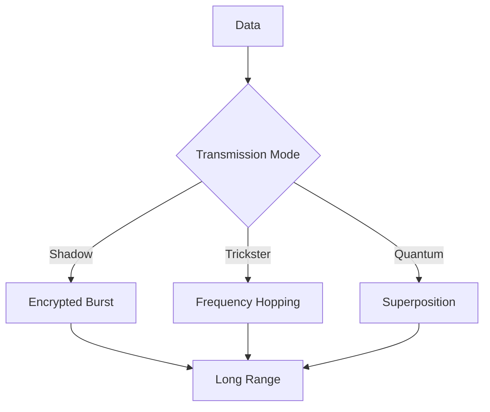

# LoRa Driver Module



## Communication Strategies
1. **Shadow LoRa**:
   - AES-256 + Quantum encryption
   - Ghost protocol packetization
   ```
   [LoRa Chant]
   Whispering across kilometers,
   Hiding in noise,
   Our messages travel,
   Unseen but heard.
   ```

2. **Trickster LoRa**:
   - 0.05-0.1 random frequency shifts
   - Adaptive power adjustment

3. **Quantum LoRa**:
   - 150-state encoding
   - LCM pattern optimization

## Performance Benchmarks
| Mode       | Range (km) | Data Rate (bps) | Security Level |
|------------|-----------|-----------------|----------------|
| Shadow     | 15        | 300             | Extreme        |
| Trickster  | 10        | 500             | High           |
| Quantum    | 20        | 200             | Quantum        |


*Figure 13: LoRa driver module with archetype-specific transmission modes*
