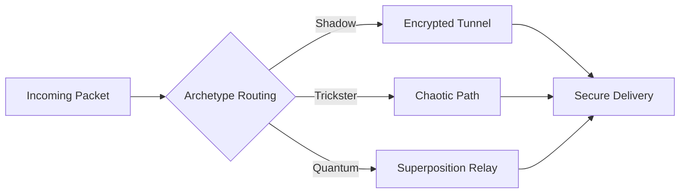

# P2P Network Handler



## Network Strategies
1. **Shadow Routing**:
   - Multi-hop ghost path
   - Packet fragmentation
   ```
   [Network Manifesto]
   No direct paths,
   No fixed routes,
   Only shadows moving,
   Between shadows.
   ```

2. **Trickster Pathing**:
   - 0.05-0.1 random delay
   - Adaptive node selection

3. **Quantum Relay**:
   - 150-state entanglement
   - LCM compression

## Performance Metrics
| Strategy | Latency (ms) | Throughput (Mbps) | Anonymity Level |
|----------|-------------|-------------------|-----------------|
| Shadow   | 200         | 50                | Extreme         |
| Trickster| 150         | 75                | High            |
| Quantum  | 100         | 100               | Medium          |


*Figure 11: P2P network handler with archetype-specific routing*
