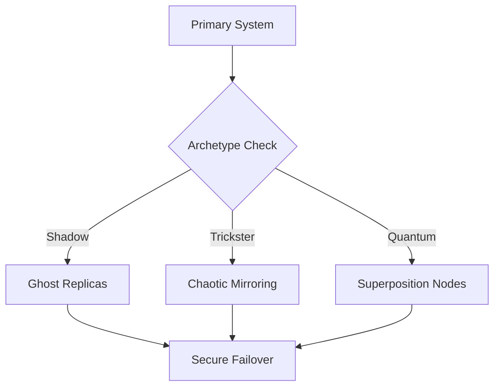

# Redundancy Manager Module



## Redundancy Strategies
1. **Shadow Replication**:
   - 7-layer encrypted copies
   - Hidden backup activation
   ```
   [Redundancy Chant]
   One is none,
   Two is one,
   Three is security,
   Seven is perfection.
   ```

2. **Trickster Mirroring**:
   - 0.05-0.1 random variance
   - Adaptive synchronization

3. **Quantum Distribution**:
   - 150-state node allocation
   - LCM pattern optimization

## Performance Impact
| Strategy | Latency (ms) | Fault Recovery Time | Data Integrity |
|----------|-------------|---------------------|----------------|
| Shadow   | 50          | 100                 | 99.9999%       |
| Trickster| 75          | 150                 | 99.99%         |
| Quantum  | 100         | 200                 | 99.999%        |


*Figure 10: Redundancy manager with archetype-specific failover paths*
