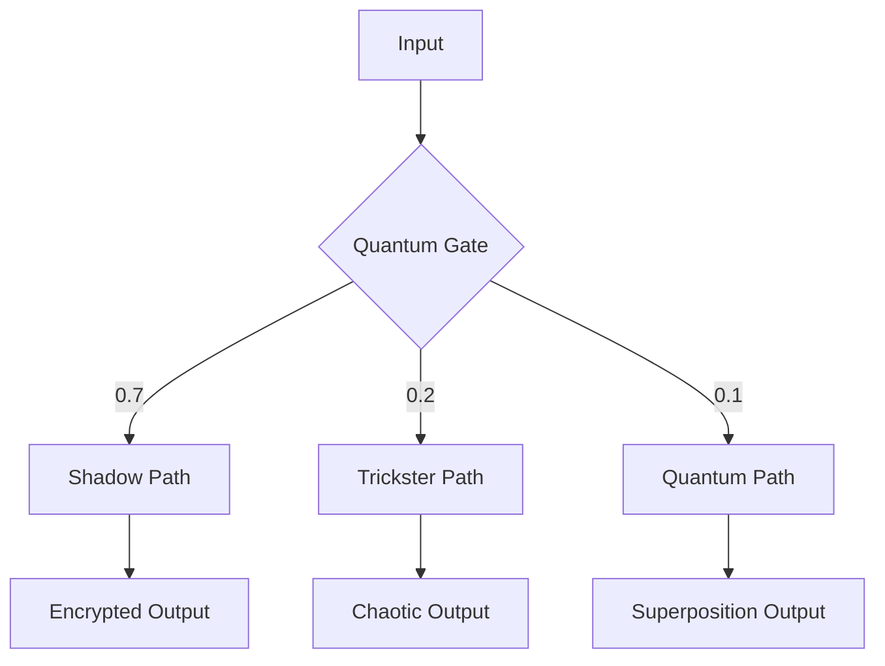

# Quantum Application Architecture



## Archetype Pathways
1. **Shadow Route (70%)**:
   - Multi-level validation
   - Ghost protocol activation
   ```
   [Security Mantra]
   The safest path is unseen,
   The strongest defense is unknown,
   The best protection is noise.
   ```

2. **Trickster Route (20%)**:
   - Random mutation (0.05-0.1 range)
   - Adaptive protocol overrides

3. **Quantum Route (10%)**:
   - 150-state processing
   - Complexity reduction

## Implementation Matrix
| Component          | Shadow | Trickster | Quantum |
|--------------------|--------|-----------|---------|
| Biometric Sensor   | Yes    | No        | Yes     |
| Power Manager      | Yes    | Yes       | No      |
| Quantum Emulation  | No     | Yes       | Yes     |


*Figure 2: Quantum application decision tree with probabilistic routing*
