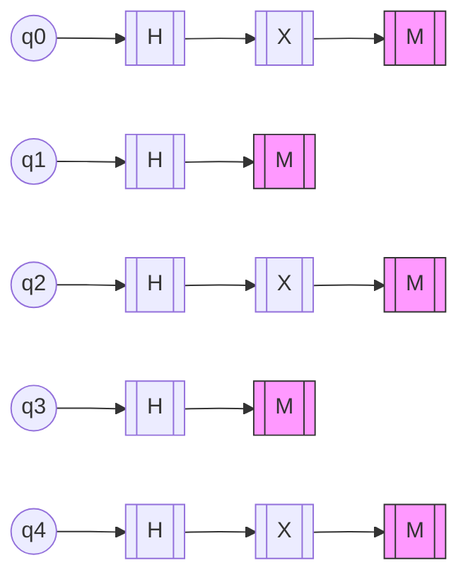

# Quantum Storage Simulation



## Storage Principles
1. **Superposition Encoding**:
   - Data exists in 150 simultaneous states
   - Collapses to classical bits on observation

2. **Entanglement Patterns**:
   ```
   [Quantum Verse]
   Each qubit knows the others,
   Without wires or signals,
   Changing one changes all,
   Instantaneously.
   ```

3. **LCM Compression**:
   - Lossless complexity reduction
   - Maintains quantum coherence

## Archetype Integration
- **Shadow**: Noise injection for security
- **Trickster**: Adaptive state mutation
- **Quantum**: Native superposition


*Figure 1: 150-state quantum storage with archetype integration*
