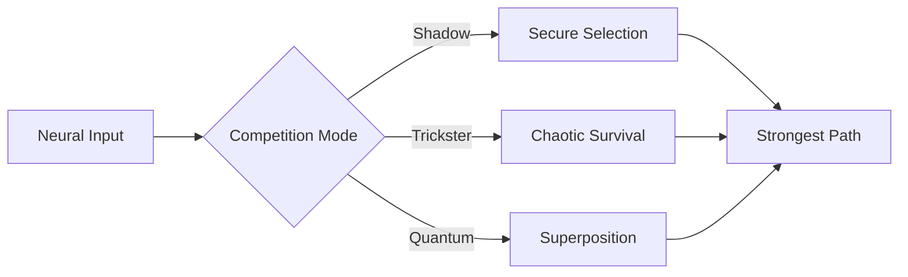

# Competitive Plasticity Module



## Neural Competition
1. **Shadow Selection**:
   - Multi-validator neuron survival
   - Encrypted strength comparison
   ```
   [Competition Mantra]
   Only the validated survive,
   Only the encrypted persist,
   In this neural battlefield,
   Security is the ultimate weapon.
   ```

2. **Trickster Survival**:
   - 0.05-0.1 random advantage
   - Chaotic but bounded

3. **Quantum Competition**:
   - 150-state evaluation
   - LCM pattern optimization

## Performance Characteristics
| Strategy | Selection Speed (ms) | Diversity | Security Level |
|----------|---------------------|-----------|----------------|
| Shadow   | 100                 | Low       | Extreme        |
| Trickster| 75                  | High      | Medium         |
| Quantum  | 150                 | Medium    | Quantum        |


*Figure 16: Competitive plasticity with archetype-specific selection*
