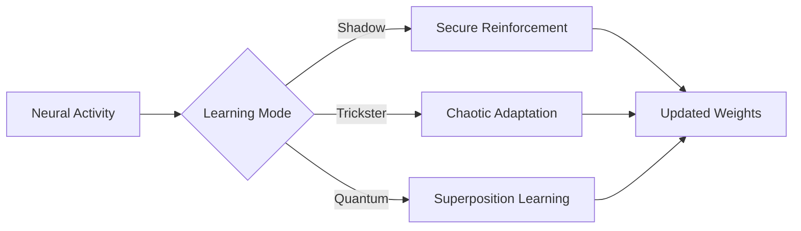

# Hebbian Updater Module



## Learning Strategies
1. **Shadow Hebbian**:
   - Multi-validator weight updates
   - Encrypted delta storage
   ```
   [Learning Mantra]
   Neurons that fire together wire together,
   But only if validated seven times,
   By ghosts in the machine.
   ```

2. **Trickster Hebbian**:
   - 0.05-0.1 random mutation
   - Bounded chaotic adjustment

3. **Quantum Hebbian**:
   - 150-state weight representation
   - LCM complexity reduction

## Performance Impact
| Strategy | Learning Rate | Stability | Security Level |
|----------|--------------|-----------|----------------|
| Shadow   | 0.01         | High      | Extreme        |
| Trickster| 0.05         | Medium    | High           |
| Quantum  | 0.1          | Low       | Quantum        |


*Figure 14: Hebbian updater with archetype-specific learning modes*
