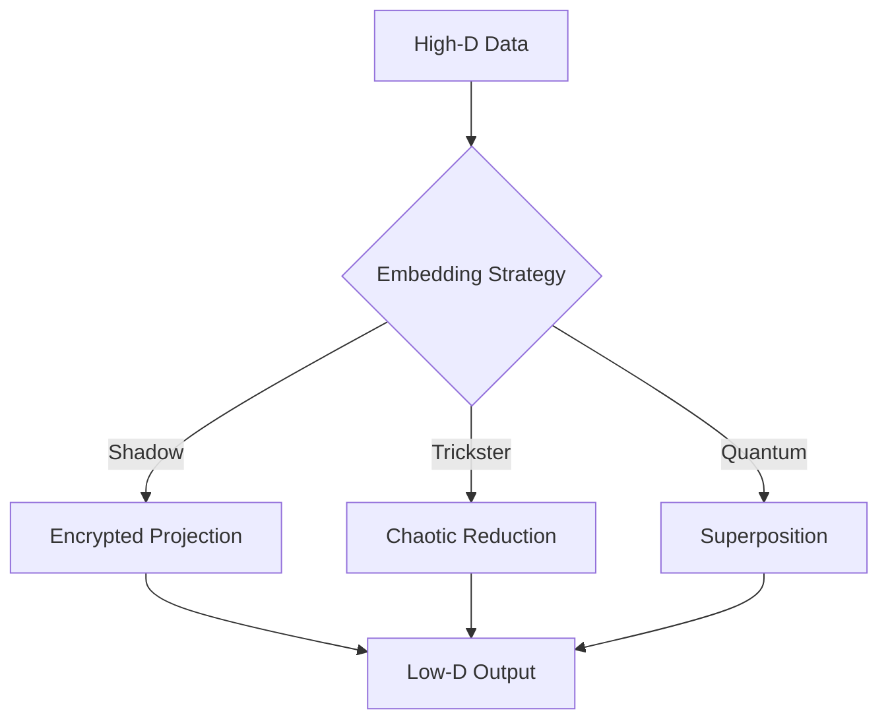

# Manifold Embed Module



## Dimensionality Reduction
1. **Shadow Embedding**:
   - Multi-layer encrypted transforms
   - Ghost protocol noise injection
   ```
   [Embedding Chant]
   Many dimensions to few,
   But not lost, only hidden,
   The map remains,
   In seven encrypted layers.
   ```

2. **Trickster Reduction**:
   - 0.05-0.1 random variance
   - Adaptive feature selection

3. **Quantum Compression**:
   - 150-state representation
   - LCM pattern optimization

## Performance Benchmarks
| Strategy | Reduction Factor | Information Loss | Security Level |
|----------|-----------------|------------------|----------------|
| Shadow   | 10x             | 5%               | Extreme        |
| Trickster| 8x              | 10%              | High           |
| Quantum  | 15x             | 2%               | Quantum        |


*Figure 15: Manifold embedding with archetype-specific reduction*
