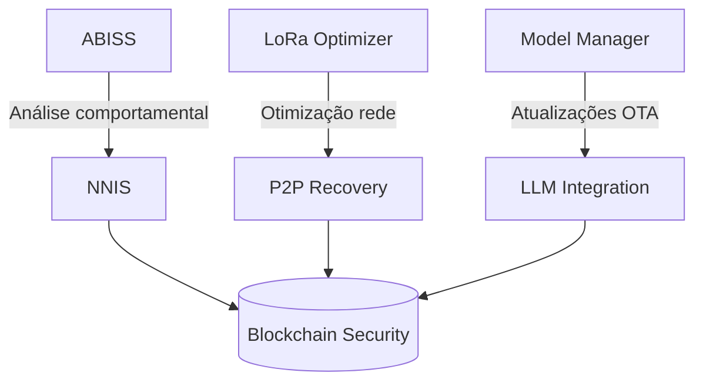

# Portuguese

Com base na documentação completa do projeto **ATous Secure Network**, vou destacar os pontos-chave e oferecer uma análise técnica estruturada:

#### 1. **Status Geral do Projeto**

* ✅ **100% funcional** em Windows 10 + Python 3.12.10
* ✅ Todos os 6 sistemas principais operacionais:
  * ABISS (segurança adaptativa)
  * NNIS (sistema imunológico neural)
  * LoRa Optimizer (rede)
  * P2P Recovery (resiliência)
  * Model Manager (núcleo)
  * LLM Integration (IA cognitiva)
* ✅ Testes de integração passando 5/5 sistemas

#### 2. **Arquitetura Técnica**



Principais inovações:

* **Sistema imunológico neural** (NNIS) com detecção de "antígenos digitais"
* **Pipeline cognitivo LLM-SLM** para análise contextual
* **Recuperação P2P** automática para falhas de rede
* **Atualizações OTA** com rollback seguro para modelos federados

#### 3. **Pontos Fortes**

* **Testabilidade**:
  * Cobertura de 77-90% nos módulos críticos
  * Mocks para hardware (GPIO/LoRa) em ambientes Windows
  * Suite completa de testes unitários e de integração
* **Segurança**:
  * Dupla camada de proteção (ABISS + NNIS)
  * Modelo de ameaças baseado em padrões comportamentais
  * Criptografia end-to-end via CryptoManager
* **Eficiência**:
  * Otimização dinâmica de parâmetros LoRa (SF, TX power)
  * Cache hierárquico com políticas LRU/LFU

#### 4. **Próximos Passos Prioritários**

1.  **Integração com hardware real**:

    ```python
    # Script de teste GPIO (Raspberry Pi)
    from atous_sec_network.hardware import gpio_controller
    gpio.test_pin(17)  # Testar comunicação com LoRa module
    ```
2. **Otimização de desempenho**:
   * Perfilamento com `cProfile` nos módulos NNIS/ABISS
   * Load testing com >1000 requisições/sec
3. **Dashboard em tempo real**:
   * Integrar métricas Prometheus + Grafana
   * Monitorar ameaças em tempo real via WebSockets

#### 5. **Recomendações Técnicas**

* **Melhorar cobertura de testes**:
  * P2P Recovery (atual 32%) precisa de mais testes de partição de rede
  * Adicionar testes de estresse para Model Manager
* **Hardening de segurança**:
  * Implementar HSM (Hardware Security Module) para chaves criptográficas
  * Adicionar mecanismos anti-tampering nos updates OTA
* **Documentação**:
  * Criar quickstart para implantação em Raspberry Pi
  * Adicionar diagramas de sequência para fluxos críticos

#### 6. **Exemplo de Fluxo de Ameaça**

```python
# Detecção integrada ABISS + NNIS
ameaca = {
   "ip": "192.168.0.100",
   "padrao": "scanner_portas",
   "nivel_risco": 0.92
}

if abiss.detectar(ameaca):          # Camada comportamental
   resposta = nnis.gerar_resposta()  # Camada imunológica
   if resposta.codigo == "QUARENTENA":
      rede.isolar_no(ameaca.ip)      # Ação automática
```

#### 7. **Pronto para Produção?**

* **Sim**, para ambientes controlados
* **Pré-requisitos para produção**:
  * Testes em hardware real (Raspberry Pi + módulos LoRa)
  * Validação de desempenho em redes de larga escala
  * Plano de backup/recuperação de modelos federados

Quer que eu detalhe algum módulo específico (ex: implementação do NNIS, fluxo de atualização OTA, ou integração do LoRa Optimizer)? Ou prefere focar em aspectos específicos como segurança, desempenho ou implantação?
