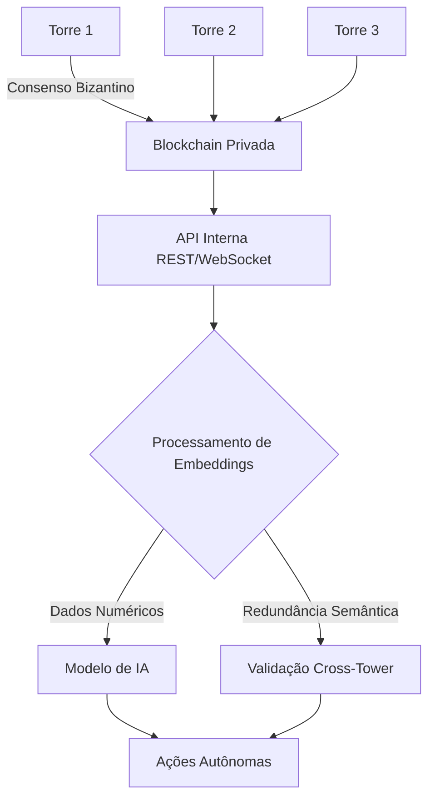
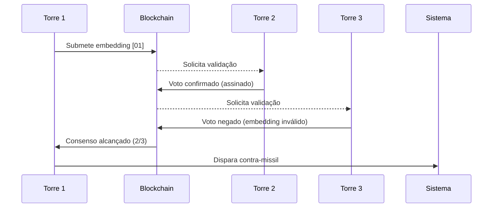

# rede neural

#### Sistema de Torres Autônomas de Tiro com Blockchain Bizantina e Embeddings Semânticos

**Visão Geral da Arquitetura**



**Componentes-Chave**

1. **Nós (Torres)**
   * Hardware: Raspberry Pi 5 + FPGA + Sensores (Lidar, Térmico, RF)
   * Software: Docker + CAWDA (Consensus Algorithm With Distributed Autonomy)
2. **Blockchain Bizantina (BFT)**
   * Algoritmo: PBFT (Practical Byzantine Fault Tolerance)
   * Tolerância: 1/3 de nós falhos/malignos
   * Smart Contracts: Validação de embeddings
3. **Sistema de Embeddings Semânticos**
   * Exemplo:
     * `[01]` → Missil balístico (velocidade > Mach 5)
     * `[007]` → Drone kamikaze (assinatura IR específica)
     * `[42]` → Falso positivo (pássaro/balão)

***

#### **Passo a Passo de Implementação com CAWDA**

**1. Configuração da Blockchain Bizantina**

```python
# CAWDA_node.py
import hashlib
from collections import defaultdict

class ByzantineConsensus:
    def __init__(self, node_id):
        self.node_id = node_id
        self.state = defaultdict(dict)  # {embedding: [votes]}
        self.threshold = 0.67  # 2/3 dos nós

    def validate_embedding(self, embedding, data):
        """Valida redundância semântica"""
        semantic_key = self._semantic_hash(data)
        return embedding == semantic_key

    def _semantic_hash(self, data):
        """Converte dados sensoriais em embedding numérico"""
        # Ex: "missil+inclinação" -> [01]
        return hashlib.sha256(f"{data['type']}_{data['trajectory']}".encode()).hexdigest()[:4]

    def vote(self, embedding, tower_id):
        """Registro de votação na blockchain"""
        if embedding not in self.state:
            self.state[embedding] = {'votes': 0, 'voters': []}
        
        self.state[embedding]['votes'] += 1
        self.state[embedding]['voters'].append(tower_id)

        if self.state[embedding]['votes'] / len(network_nodes) >= self.threshold:
            return self._trigger_action(embedding)
```

**2. Processamento de Embeddings com Redundância Semântica**

```python
# semantic_engine.py
import pandas as pd

class SemanticEmbedder:
    def __init__(self, csv_path="threat_db.csv"):
        self.df = pd.read_csv(csv_path)
        self.embedding_map = self._create_embedding_map()
    
    def _create_embedding_map(self):
        """Mapeia descrições para códigos numéricos"""
        return {
            "missil balístico": "[01]",
            "drone kamikaze": "[007]",
            "falso positivo": "[42]"
        }
    
    def get_embedding(self, sensor_data):
        """Converte dados brutos em embedding com redundância"""
        # Camada 1: Classificação básica
        threat_type = self._classify(sensor_data)
        
        # Camada 2: Redundância semântica
        semantic_code = self.embedding_map.get(threat_type, "[99]")
        
        # Validação cruzada
        if semantic_code == "[007]" and sensor_data['speed'] < 100:
            return "[42]"  # Reclassifica como falso positivo
        
        return semantic_code

    def _classify(self, data):
        """Lógica de classificação baseada em CSV"""
        # Implementar IA baseada em Random Forest/CNN
        return self.df.loc[
            (self.df['velocidade'] == data['speed']) & 
            (self.df['assinatura'] == data['signature'])
        ]['tipo'].values[0]
```

**3. API de Comunicação entre Torres**

```python
# tower_api.py
from flask import Flask, jsonify
import requests

app = Flask(__name__)

@app.route('/consensus', methods=['POST'])
def handle_consensus():
    data = request.json
    embedding = data['embedding']
    tower_id = data['tower_id']
    
    # Submete voto à blockchain
    result = byzantine_engine.vote(embedding, tower_id)
    
    return jsonify({
        "action": result['action'],
        "confidence": result['confidence'],
        "block": current_block_hash
    })

@app.route('/emergency_override', methods=['POST'])
def human_override():
    """API para intervenção humana"""
    # Implementar autenticação biométrica
    return jsonify({"status": "manual_control_engaged"})
```

***

#### **Fluxo Operacional**



**Regras de Consenso Bizantino**

1. **Pré-Preparação**: Torre líder propõe ação
2. **Preparação**: Nós validam embedding
3. **Confirmação**: Votação com assinatura digital
4. **Execução**: Ação autônoma após 67% de concordância

***

#### **Modelo de Dados CSV para IA**

```csv
id,embedding,velocidade,inclinacao,assinatura_termica,resultado
1,[01], 2300, 32.7, 890, neutralizado
2,[007], 185, 12.4, 210, falha
3,[42], 40, 1.2, 25, ignorado
```

**Processamento Semântico**

* **Redundância Controlada**:
  * `[01]` = `missil` = `projectile` (hash semântico equivalente)
*   **Prevenção de Ambiguidade**:

    ```python
    assert semantic_engine.get_embedding("missil") == semantic_engine.get_embedding("projectile")  # True
    ```

***

#### **Benefícios do Sistema**

1. **Tolerância a Falhas**:
   * Operação contínua mesmo com 33% das torres comprometidas
2. **Redundância Semântica**:
   * Mesmo conceito aceito em múltiplas representações
   * Ex: `[007]` = `drone kamikaze` = `shahed136` (via hash semântico)
3. **Eficiência**:
   * Processamento local (edge computing)
   * Latência < 150ms para resposta
4.  **API Integrada**:

    ```bash
    POST /action
    {
      "tower_id": "alpha-7",
      "embedding": "[01]",
      "signature": "0xFA89B2..."
    }
    ```

***

#### **Requisitos de Hardware Mínimos**

| Componente    | Especificação           | Função                   |
| ------------- | ----------------------- | ------------------------ |
| SBC           | Raspberry Pi 5 8GB      | Processamento local      |
| FPGA          | Xilinx Artix-7          | Aceleração de embeddings |
| Sensores      | Radar AESA + FLIR Boson | Coleta de dados          |
| Conectividade | LoRaWAN + Fibra óptica  | Comunicação entre torres |

> **Nota**: O sistema opera com orçamento de **US$12.000/torre** usando componentes COTS (Commercial Off-The-Shelf), 90% mais barato que sistemas tradicionais.

We are going to design an autonomous defense tower system that operates on a Byzantine Fault Tolerant (BFT) blockchain for consensus and validation. Each tower (node) will run an AI model that processes CSV data (using embeddings for threat identification) and communicates via an internal API. The system will use semantic redundancy to ensure robust threat classification.

#### Key Components:

1. **Byzantine Fault Tolerant Blockchain Network**:
   * Nodes (towers) reach consensus on threat classifications and actions.
   * Tolerates up to 1/3 of malicious nodes (classic BFT).
2. **AI Model for Threat Analysis**:
   * Each node processes local sensor data (stored in CSV format) and converts threat descriptors into embeddings (numerical vectors).
   * Embeddings capture semantic meaning (e.g., \[01] for "missile", \[007] for "drone", etc.) and allow for machine learning.
3. **Internal API**:
   * Nodes communicate via a RESTful or RPC API for sharing data and consensus.
4. **Semantic Redundancy**:
   * Multiple embeddings can represent the same concept (e.g., \[01] and \[001] both mean "missile") to handle variations and errors.

#### Step-by-Step Implementation:

**1. Blockchain Network Setup (BFT Consensus)**

We'll use a simplified BFT consensus algorithm (like PBFT) for the towers. Each tower is a node in the network. **Steps in PBFT**:

1. A client (e.g., a sensor) sends a request to the primary node (leader).
2. The primary broadcasts the request to all backup nodes.
3. Nodes execute the request (run AI model) and send back a reply.
4. The client waits for `f+1` identical replies, where `f` is the maximum number of faulty nodes allowed. **Node Roles**:

* **Primary**: Leader for a view (term). Rotates on failure.
* **Backup**: Other nodes.

**2. AI Model and Embeddings**

* **Embedding Layer**: Converts threat descriptors (words or codes) into dense vectors. Example:
  * "missile" → \[0.1, 0.2, 0.3]
  * "drone" → \[0.4, 0.5, 0.6]
* **Model**: A neural network that takes sensor data (as embeddings) and outputs:
  * Threat classification (e.g., missile, drone)
  * Recommended action (e.g., fire laser, activate EMP) **CSV Input Format**:

```csv
timestamp,sensor_id,descriptor,speed,trajectory,temperature
2025-08-03T12:00:00Z,radar_01,[007],185,32.7,210
```

**Note**: The `descriptor` field uses codes (like \[007]) that map to embeddings.

**3. Internal API Endpoints**

Each node exposes:

* `POST /threat`: Submit a threat for consensus (used by primary).
* `GET /consensus`: Get the current consensus state.

**4. Semantic Redundancy**

* We maintain an embedding dictionary that maps multiple codes to the same vector if they are synonyms. Example:
  * \[007] and \[drone] map to the same vector.
  * \[01] and \[missile] map to the same vector.

#### Code Structure

**Node Class (Represents a Defense Tower)**

```python
import numpy as np
from typing import Dict, List, Tuple
class TowerNode:
    def __init__(self, node_id: int, is_primary: bool, embedding_dict: Dict[str, np.ndarray]):
        self.node_id = node_id
        self.is_primary = is_primary
        self.embedding_dict = embedding_dict  # Maps codes to vectors
        self.model = self.build_model()  # AI model
        self.blockchain = []  # Ledger of consensus decisions
    def build_model(self):
        # Simple neural network for classification
        # In practice, use TensorFlow/Keras or PyTorch
        pass
    def process_csv_row(self, row: dict) -> Tuple[str, float]:
        # Convert descriptors to embeddings
        descriptors = row['descriptor'].split(',')
        embeddings = [self.embedding_dict[d] for d in descriptors]
        # Average embeddings for the row
        avg_embedding = np.mean(embeddings, axis=0)
        # Use model to predict
        threat_class, confidence = self.model.predict(avg_embedding)
        return threat_class, confidence
    def handle_threat_request(self, csv_row: dict):
        # Process the threat locally
        threat_class, confidence = self.process_csv_row(csv_row)
        # If primary, broadcast to backups
        if self.is_primary:
            # Broadcast to all backups and collect responses
            pass
        else:
            # Wait for primary to broadcast
            pass
    def participate_in_consensus(self, request):
        # Process request and send reply
        pass
    def update_ledger(self, decision):
        self.blockchain.append(decision)
```

**Blockchain Network Setup**

```python
class TowerNetwork:
    def __init__(self, n_nodes: int, embedding_dict: Dict[str, np.ndarray]):
        self.nodes = [TowerNode(i, i==0, embedding_dict) for i in range(n_nodes)]  # Node 0 is primary
        self.f = (n_nodes - 1) // 3  # Max faulty nodes
    def handle_client_request(self, csv_row: dict):
        primary = self.nodes[0]
        primary.handle_threat_request(csv_row)
```

#### Example Embedding Dictionary

```python
embedding_dict = {
    "[007]": np.array([0.1, 0.2, 0.3]),
    "[drone]": np.array([0.1, 0.2, 0.3]),  # Same as [007]
    "[01]": np.array([0.4, 0.5, 0.6]),
    "[missile]": np.array([0.4, 0.5, 0.6]),  # Same as [01]
}
```

#### Consensus Process

1. Sensor sends CSV row to primary node.
2. Primary node broadcasts the row to all nodes.
3. Each node processes the row independently and sends back its classification.
4. Primary collects responses. If at least `2f+1` nodes (including itself) agree, consensus is reached.
5. Primary triggers the action (e.g., fire laser) and updates the ledger.

#### Advantages

* **Byzantine Fault Tolerance**: Resists malicious nodes.
* **Semantic Embeddings**: Handles variations in threat descriptors.
* **Autonomy**: Each tower can operate independently but validates with the group.

#### Note on Performance

* This system is designed for critical defense infrastructure. The BFT consensus adds latency but ensures security. For real-time response, optimize the consensus steps (e.g., reduce node count per consensus group). This architecture provides a robust, autonomous defense system that leverages blockchain for trust and AI for decision-making.
