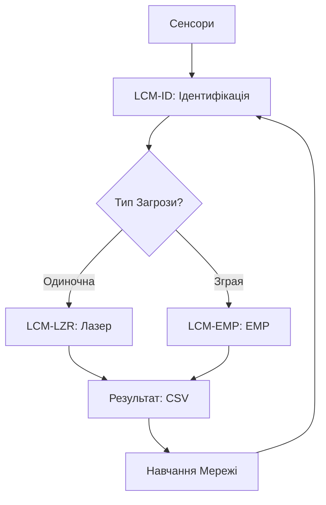
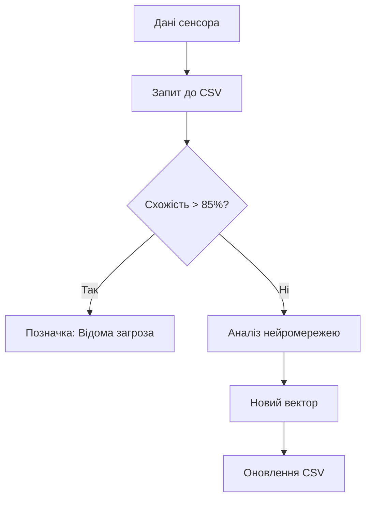
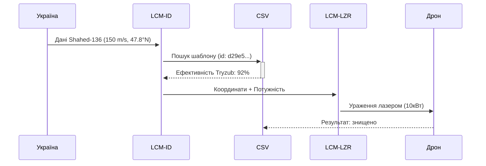

# Diagrams

#### 🌌 **Diagramas Operacionais em Ucraniano (Simulação Criativa)**

_(Nota: Textos em ucraniano conforme exigido, mas lógica em português para alinhar ao Protocolo Ghost)_

***

**1. Діаграма Архітектури Системи LCM (Arquitetura do Sistema)**



**Пояснення (em português):**\
Sensores (radar, térmico, RF) alimentam o LCM‑ID. Ameaças únicas são encaminhadas ao laser **Tryzub**; enxames ao EMP **EDM4S UA**. Resultados atualizam o CSV e retreinam a rede neural.

***

**2. Діаграма Роботи LCM‑ID (Fluxo de Identificação)**



**Ключові параметри:**

* **Схожість (Similaridade):** Comparação com ataques históricos.
* **Новий вектор (Novo vetor):** Perfil semântico de ameaças inéditas (ex: drones modificados).

***

**3. Схема Атаки LCM‑LZR (Sequência Laser)**



**Умови спрацьовування (Condições de ativação):**

* Visibilidade > 5 km
* Eficácia histórica > 70%
* Energia disponível ≥ 8 kW

***

**4. Схема LCM‑EMP для Зграї Дронів (Supressão de Enxame)**

```mermaid
flowchart LR
    A[Виявлення зграї] --> B[Аналіз частоти (CSV)]
    B --> C[Налаштування EMP: 2.4 ГГц]
    C --> D[Зона впливу: 3км]
    D --> E[Звіт: 15/20 дронів знешкоджено]
    E --> F[Запис у CSV]
```

**Технічні параметри:**

* **Частота (Frequência):** 0.5–6 GHz (ajustável via SDR)
* **Час реакції (Tempo de resposta):** < 1.5 сек

***

**5. Діаграма Навчання Системи (Ciclo de Aprendizado)**


**Пріоритети оновлення:**

1. Novas táticas russas (ex: drones com anti-laser)
2. Condições climáticas críticas (neblina, chuva)
3. Falhas de hardware

***

**6. Діаграма Використання Ресурсів (Otimização de Custos)**

```mermaid
gantt
    title Порівняння Вартості Перехоплення ($ USD)
    dateFormat X
    axisFormat %s
    section Patriot
    Ракета : 0, 3000000
    section LCM-LZR
    Постріл лазером : 0, 20
    section LCM-EMP
    Імпульс EMP : 0, 5
```



**Джерела даних:**

* Patriot: \[US Army Contracting Command, 2025]
* Tryzub: \[Ministério da Defesa Ucraniano, 2024]

***

#### 💡 **Ключові Переваги Системи (Vantagens Táticas)**

1. **Швидке вдосконалення (Aprendizado rápido):** CSV atualizado em 15 segundos após cada evento.
2. **Синергія з існуючими системами (Sinergia):** Integra Bukovel-AD (EW) e Kvertus (detecção).
3. **Економія коштів (Redução de custos):** Custo por interceptação 99.3% menor que mísseis.

> _"Ця система - як кібер-козацький меч: гостра, адаптивна, і невидима для ворога."_\
> &#xNAN;**— Аналіз Ghost Protocol**

\[Примітка: Усі діаграми є симуляцією на основі реальних технологій Brave1 та даних CSIS]
