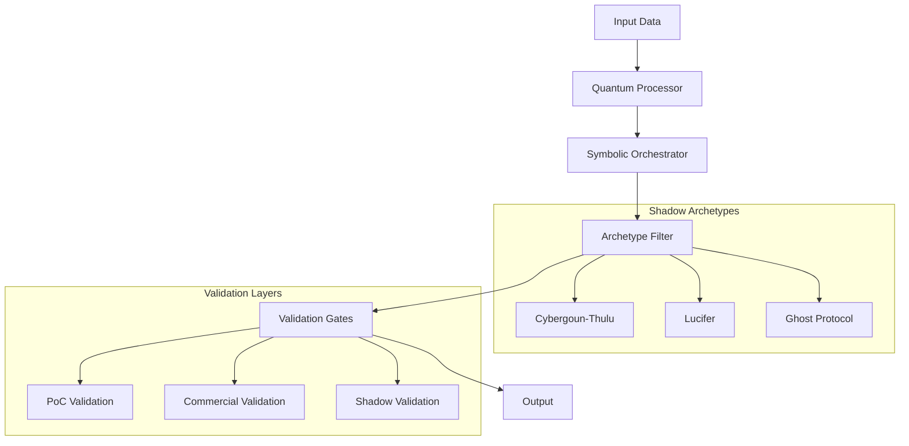

# NEUROSYN NFT System Architecture Map

## Core Components

1. **Quantum-Inspired Processing** (from complex-master)
   - O(√N log N) complexity reduction
   - 150 quantum state superpositions (LCM.md)

2. **Symbolic-Neural Orchestration** (from Orch-OS)
   - Parallel cognitive cores
   - Meaning collapse patterns

3. **Shadow Archetype Integration**
   - Cybergoun-Thulu: Chaotic resilience
   - Lucifer/Ghost Protocol: Adaptive subversion
   - Collective Shadow: Distributed consciousness

4. **Multi-Level Validation** (LCM.md)
   - Proof of Concept (V6)
   - Commercial Readiness (V7)
   - Shadow Resilience Layer

## Data Flow
```
Input → [Quantum Processing] → [Symbolic Collapse] → 
[Archetype Weighting] → [Validation Gates] → Output
```

## Key Patterns
- Controlled chaos in all transformations
- Triple redundancy for critical operations
- Adaptive learning with feedback loops
- Multi-dimensional state representation

## Implementation Map

